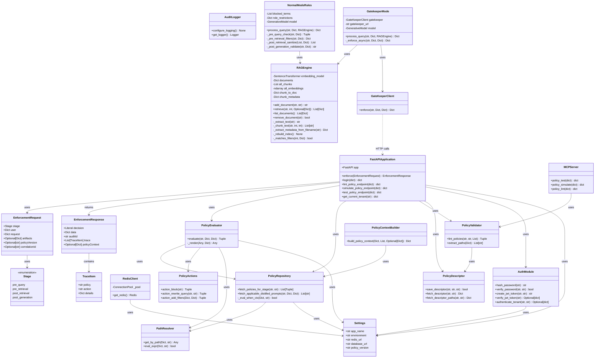

# GateKeeper Class Diagram

This document contains the UML class diagram for the GateKeeper project, following standard UML conventions.

## PlantUML Format

The PlantUML source file is available at `class_diagram.puml` and can be rendered using:
- PlantUML tools (VS Code extension, online editor, etc.)
- IntelliJ IDEA / PyCharm
- Any PlantUML-compatible tool

## Mermaid Format (Rendered Below)

## Diagram Legend

### Visibility Modifiers
- `+` = Public
- `-` = Private
- `#` = Protected

### Package Organization
The diagram is organized into logical packages:
1. **backend.app.models** - Data models (Pydantic BaseModel classes)
2. **backend.app.core** - Core configuration and infrastructure
3. **backend.app.auth** - Authentication and authorization
4. **backend.app.policies** - Policy evaluation and management
5. **backend.app.audit** - Audit logging
6. **backend.app** - Main FastAPI application
7. **mcp.server** - MCP server for policy tools
8. **rag_demo.backend** - Demo RAG engine components
9. **sdk.python.gatekeeper_sdk** - Python SDK client

### Key Relationships

1. **FastAPIApplication** is the main entry point that orchestrates:
   - Policy evaluation through `PolicyEvaluator`
   - Policy retrieval through `PolicyRepository`
   - Policy validation through `PolicyValidator`
   - Authentication through `AuthModule`

2. **PolicyEvaluator** coordinates policy evaluation by:
   - Fetching policies via `PolicyRepository`
   - Executing actions via `PolicyActions`
   - Resolving paths via `PathResolver`

3. **PolicyValidator** ensures policy correctness by:
   - Validating against schema descriptors via `PolicyDescriptor`

4. **RAG Demo Components** demonstrate integration:
   - `NormalModeRules` uses hardcoded rules
   - `GatekeeperMode` integrates with the GateKeeper API via `GateKeeperClient`

### Design Patterns

- **Repository Pattern**: `PolicyRepository` abstracts database access
- **Strategy Pattern**: Different policy actions (`PolicyActions`) can be applied
- **Factory Pattern**: `PolicyContextBuilder` creates policy contexts
- **Dependency Injection**: Settings and configuration are injected via `Settings` class

