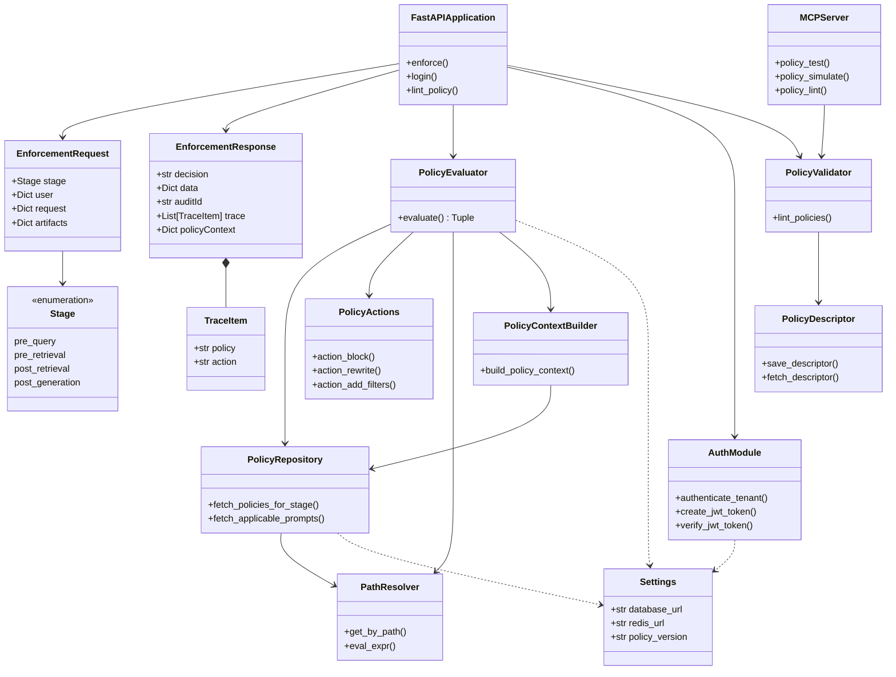

# GateKeeper Class Diagram - Research Paper Version

This is a high-level, concise class diagram optimized for two-column research paper format.

## Features

- **Compact Layout**: Optimized for limited space in two-column format
- **Core Classes Only**: Removed demo components and internal implementation details
- **Professional Appearance**: Clean, minimal design suitable for academic papers
- **Complete Coverage**: All essential classes and relationships included

## Diagram



## Package Organization

1. **Models**: Data transfer objects (DTOs) for API communication
2. **Core**: Configuration and infrastructure
3. **Policy Engine**: Core policy evaluation and management components
4. **Authentication**: User authentication and authorization
5. **Application**: Main FastAPI application layer
6. **MCP Tools**: Model Context Protocol server for policy tooling

## Key Classes

### Application Layer
- **FastAPIApplication**: Main entry point, exposes REST API endpoints

### Policy Engine
- **PolicyEvaluator**: Core policy evaluation engine
- **PolicyRepository**: Data access layer for policies
- **PolicyValidator**: Validates policies against schema
- **PolicyActions**: Executes policy actions (block, rewrite, filter)
- **PathResolver**: Resolves path expressions and evaluates conditions
- **PolicyContextBuilder**: Builds policy context for LLM prompts
- **PolicyDescriptor**: Manages schema descriptors

### Models
- **EnforcementRequest**: Input model for policy enforcement
- **EnforcementResponse**: Output model with decision and trace
- **TraceItem**: Individual policy execution trace entry
- **Stage**: Enumeration of enforcement stages

### Supporting
- **AuthModule**: Authentication and JWT token management
- **Settings**: Application configuration
- **MCPServer**: MCP tools for policy testing and simulation

## Relationships

- **Composition**: EnforcementResponse contains TraceItem
- **Association**: EnforcementRequest uses Stage enum
- **Dependency**: Policy components depend on Settings
- **Usage**: FastAPIApplication uses PolicyEvaluator and other components

## For Research Paper

### Export Instructions

1. **PlantUML**: Export as SVG (vector format, best quality)
2. **Resolution**: 300 DPI minimum for print
3. **Format**: SVG preferred, PNG acceptable at high resolution

### Caption Suggestion

```
Figure X: GateKeeper System Class Diagram showing core components and their relationships. The system is organized into six packages: Models (data transfer objects), Core (configuration), Policy Engine (evaluation and management), Authentication, Application (REST API), and MCP Tools (policy tooling).
```

### Usage in Paper

- Include in "System Architecture" or "Design" section
- Reference when discussing component interactions
- Use to explain policy evaluation flow
- Suitable for methodology or implementation sections

## File

- **PlantUML Source**: `class_diagram_research.puml`
- **This Document**: `class_diagram_research.md`

