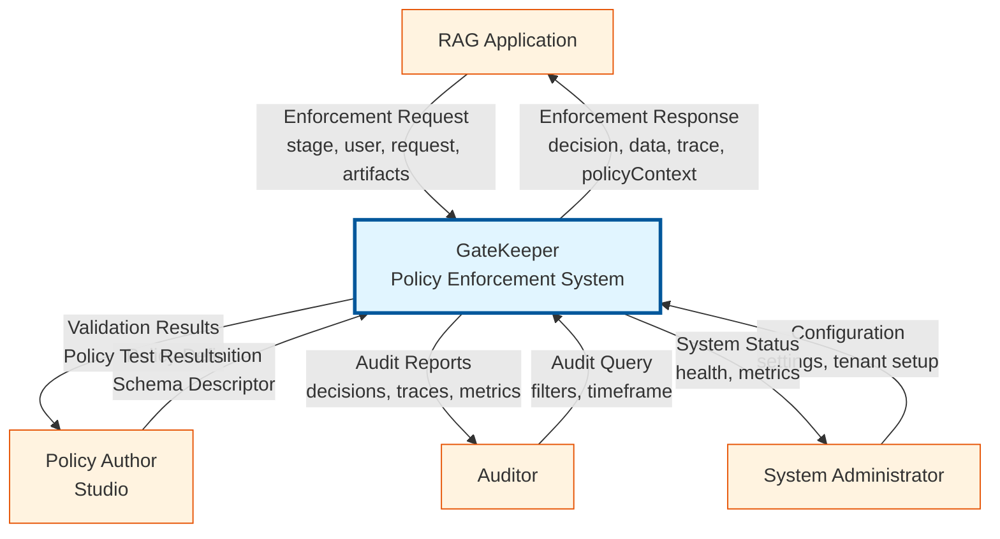
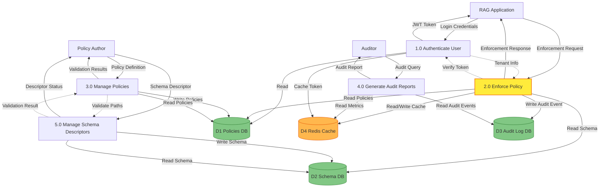
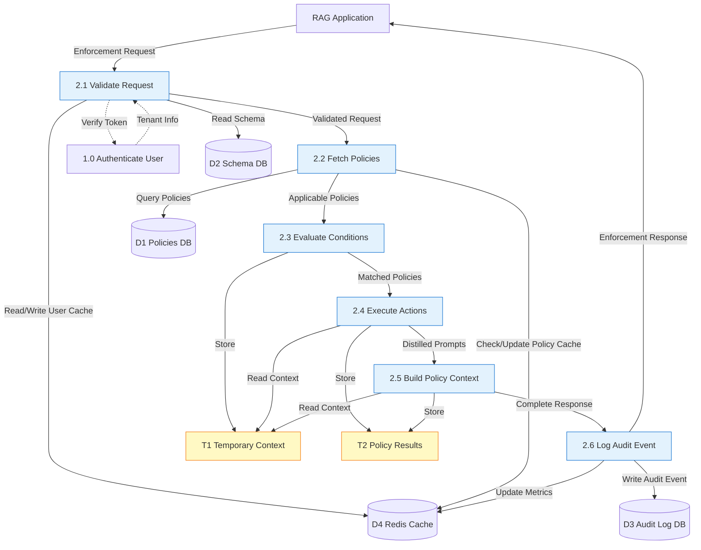

# GateKeeper Data Flow Diagrams - All Levels

This document contains all three levels of Data Flow Diagrams (DFD) for the GateKeeper Policy Enforcement System, suitable for research paper inclusion.

## Table of Contents

1. [Level 0: Context Diagram](#level-0-context-diagram)
2. [Level 1: Top-Level DFD](#level-1-top-level-dfd)
3. [Level 2: Enforce Policy Process Detail](#level-2-enforce-policy-process-detail)
4. [Data Dictionary](#data-dictionary)
5. [Process Specifications](#process-specifications)

---

## Level 0: Context Diagram

**Purpose**: Represents the GateKeeper system as a single process (black box) showing all interactions with external entities.

### External Entities

| Entity | Description |
|--------|-------------|
| RAG Application | Client application requesting policy enforcement at various stages |
| Policy Author (Studio) | Users creating and managing policies through Rules Studio interface |
| Auditor | Users querying audit logs and generating compliance reports |
| System Administrator | Administrators configuring and monitoring system health |

### Data Flows

| Flow | Direction | Description |
|------|-----------|-------------|
| Enforcement Request | RAG → GateKeeper | Contains stage, user context, request data, artifacts |
| Enforcement Response | GateKeeper → RAG | Contains decision, modified data, trace, policy context |
| Policy Definition | Author → GateKeeper | YAML/JSON policy with conditions and actions |
| Schema Descriptor | Author → GateKeeper | User attributes and document metadata schema |
| Validation Results | GateKeeper → Author | Errors and warnings from policy validation |
| Policy Test Results | GateKeeper → Author | Results from policy testing |
| Audit Query | Auditor → GateKeeper | Filters and timeframe for reports |
| Audit Reports | GateKeeper → Auditor | Decision traces, metrics, compliance data |
| Configuration | Admin → GateKeeper | System settings and tenant setup |
| System Status | GateKeeper → Admin | Health checks and performance metrics |

### Diagram



**PlantUML Source**: `dfd_level0.puml`

---

## Level 1: Top-Level DFD

**Purpose**: Decomposes the GateKeeper system into major functional processes and shows data stores.

### Processes

| Process | Description |
|---------|-------------|
| 1.0 Authenticate User | Validates credentials, issues JWT tokens, manages tenant authentication |
| 2.0 Enforce Policy | Main enforcement process: evaluates policies, executes actions, builds context |
| 3.0 Manage Policies | Validates, stores, tests, and lints policies |
| 4.0 Generate Audit Reports | Queries audit logs, aggregates metrics, generates compliance reports |
| 5.0 Manage Schema Descriptors | Stores and validates schema definitions for user attributes and document metadata |

### Data Stores

| Store | Description |
|-------|-------------|
| D1: Policies Database | Stores policies, policy versions, tenant information (PostgreSQL) |
| D2: Schema Descriptors Database | Stores user attribute and document metadata schemas (PostgreSQL) |
| D3: Audit Log Database | Stores audit events, decision traces, metrics (PostgreSQL) |
| D4: Redis Cache | Caches user attributes, policies, rate limit counters (Redis) |

### Diagram



**PlantUML Source**: `dfd_level1.puml`

---

## Level 2: Enforce Policy Process Detail

**Purpose**: Detailed decomposition of Process 2.0 (Enforce Policy) showing internal sub-processes and data flows.

### Sub-Processes

| Process | Description |
|---------|-------------|
| 2.1 Validate Request | Verifies JWT token, validates request format, loads user context |
| 2.2 Fetch Policies | Queries policies by stage/version, filters by enabled, orders by priority |
| 2.3 Evaluate Conditions | Parses 'when' clauses, resolves path expressions, evaluates conditions |
| 2.4 Execute Actions | Executes policy actions (block, rewrite, filter, redact) |
| 2.5 Build Policy Context | Collects distilled prompts, builds instruction set for LLM |
| 2.6 Log Audit Event | Creates audit record, updates metrics, generates audit_id |

### Temporary Data Stores

| Store | Description |
|-------|-------------|
| T1: Temporary Context | Stores user, request, and artifacts during processing |
| T2: Policy Results | Stores action results, decisions, and policy context |

### Diagram



**PlantUML Source**: `dfd_level2.puml`

### Data Flow Sequence

1. **2.1 Validate Request**
   - Receives: Enforcement Request from RAG Application
   - Verifies: JWT token via Process 1.0
   - Loads: User context from cache or database
   - Validates: Request format and required fields
   - Outputs: Validated Request to 2.2

2. **2.2 Fetch Policies**
   - Receives: Validated Request from 2.1
   - Queries: Policies from D1 (by stage, version, enabled)
   - Checks: Redis cache for cached policies
   - Orders: Policies by priority (descending)
   - Outputs: Applicable Policies to 2.3

3. **2.3 Evaluate Conditions**
   - Receives: Applicable Policies from 2.2
   - Parses: 'when' clauses (all/any conditions)
   - Resolves: Path expressions (user.role, doc.metadata.tags)
   - Evaluates: Conditions against request context
   - Matches: Query patterns against request
   - Stores: Context in T1
   - Outputs: Matched Policies to 2.4

4. **2.4 Execute Actions**
   - Receives: Matched Policies from 2.3
   - Executes: Policy actions (block, rewrite, filter, redact)
   - Substitutes: Templates (${user.department})
   - Stores: Results in T2
   - Outputs: Distilled Prompts to 2.5

5. **2.5 Build Policy Context**
   - Receives: Distilled Prompts from 2.4
   - Collects: Applicable distilled prompts
   - Builds: Instruction set for LLM
   - Adds: Role scope and normalization hints
   - Stores: Policy context in T2
   - Outputs: Complete Response to 2.6

6. **2.6 Log Audit Event**
   - Receives: Complete Response from 2.5
   - Creates: Audit record with decision and trace
   - Updates: Metrics counters in D4
   - Generates: audit_id
   - Writes: Audit event to D3
   - Outputs: Enforcement Response to RAG Application

---

## Data Dictionary

### Enforcement Request
- **Type**: Complex Data Structure
- **Source**: RAG Application
- **Destination**: Process 2.1
- **Structure**:
  ```json
  {
    "stage": "pre_query | pre_retrieval | post_retrieval | post_generation",
    "user": {
      "id": "string",
      "role": "string",
      "department": "string",
      ...
    },
    "request": {
      "query": "string",
      "filters": {},
      ...
    },
    "artifacts": {
      "chunks": [],
      "answer": "string",
      ...
    },
    "policyVersion": "string",
    "correlationId": "string"
  }
  ```

### Enforcement Response
- **Type**: Complex Data Structure
- **Source**: Process 2.6
- **Destination**: RAG Application
- **Structure**:
  ```json
  {
    "decision": "allowed | modified | blocked",
    "data": {
      "request": {
        "query": "string",
        "filters": {}
      }
    },
    "auditId": "string",
    "trace": [
      {
        "policy": "string",
        "action": "string",
        "details": {}
      }
    ],
    "policyContext": {
      "instruction": "string",
      "required_behavior": "string",
      "normalization_hints": [],
      "role_scope": {},
      "rules": []
    }
  }
  ```

### Policy Definition
- **Type**: Complex Data Structure
- **Source**: Policy Author
- **Destination**: Process 3.0
- **Structure**:
  ```yaml
  name: string
  stage: string
  priority: integer
  when:
    all: []
    any: []
  match:
    query.text: []
  action:
    type: block | rewrite | filter | redact
    message: string
    filters: {}
  ```

---

## Process Specifications

### Process 2.0: Enforce Policy

**Process Number**: 2.0  
**Process Name**: Enforce Policy  
**Inputs**: 
- Enforcement Request (from RAG Application)
- JWT Token (from RAG Application)

**Outputs**:
- Enforcement Response (to RAG Application)
- Audit Event (to D3: Audit Log Database)

**Process Logic**:
1. Validate request format and authenticate user (via Process 1.0)
2. Fetch applicable policies for the specified stage and version
3. Evaluate policy conditions against request context
4. Execute matched policy actions (block, rewrite, filter, redact)
5. Build policy context from distilled prompts
6. Log audit event with decision and trace
7. Return enforcement response

**Error Handling**:
- Invalid token → Return 401 Unauthorized
- Invalid request format → Return 400 Bad Request
- No policies found → Return allowed decision with empty trace
- Policy evaluation error → Log error, continue with next policy
- Database error → Return 500 Internal Server Error

**Performance Requirements**:
- Response time: < 100ms (with cache)
- Cache hit rate: > 80%
- Concurrent requests: 1000+

---

## DFD Validation Checklist

Following standard Software Engineering DFD rules:

- ✅ **Conservation of Data**: All data flows are balanced between levels
- ✅ **No Black Holes**: Every process has at least one output
- ✅ **No Miracles**: Every process has at least one input
- ✅ **Unique Names**: All data flows and stores have unique names
- ✅ **Process Numbering**: Processes numbered hierarchically (1.0, 2.0, 2.1, etc.)
- ✅ **Data Store Numbering**: Data stores numbered sequentially (D1, D2, D3, D4)
- ✅ **Unidirectional Flows**: All data flows are unidirectional
- ✅ **Verb-Noun Format**: Process names use verb-noun format
- ✅ **Labeled Flows**: All data flows are labeled with data names
- ✅ **External Entities**: All external entities clearly identified

---

## Research Paper Usage

These DFDs are suitable for inclusion in research papers and follow standard Software Engineering conventions:

1. **Level 0** demonstrates system boundaries and external interactions
2. **Level 1** shows major functional decomposition
3. **Level 2** provides detailed process flow for the main enforcement process

### Citation Format

When referencing these diagrams in your research paper:

> "The GateKeeper system architecture is represented through hierarchical Data Flow Diagrams (DFD) at three levels: Level 0 (Context Diagram) showing system boundaries, Level 1 (Top-Level DFD) decomposing major processes, and Level 2 (Detailed DFD) providing granular process flows for policy enforcement."

---

## File References

- **Level 0 PlantUML**: `docs/dfd_level0.puml`
- **Level 1 PlantUML**: `docs/dfd_level1.puml`
- **Level 2 PlantUML**: `docs/dfd_level2.puml`
- **Documentation**: `docs/dfd_documentation.md`
- **This File**: `docs/dfd_all_levels.md`

---

## Revision History

- **v1.0** (2025-01-XX): Initial DFD creation with all three levels following SE standards

