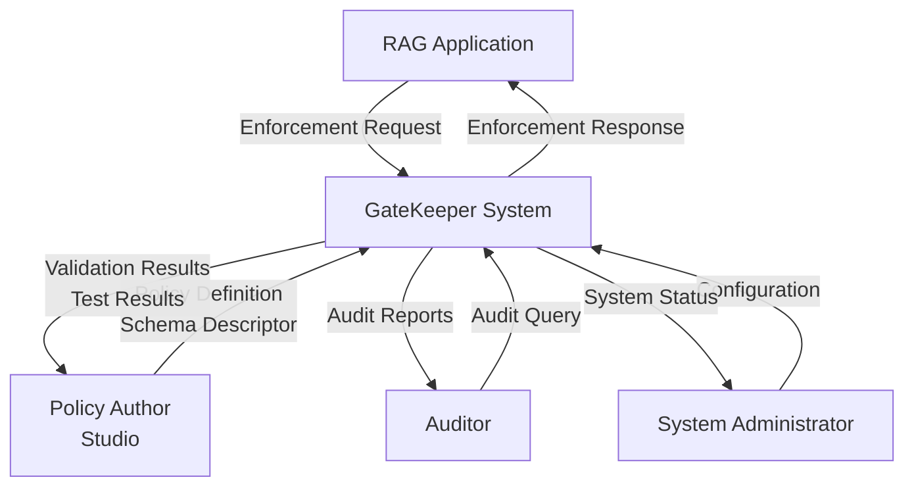
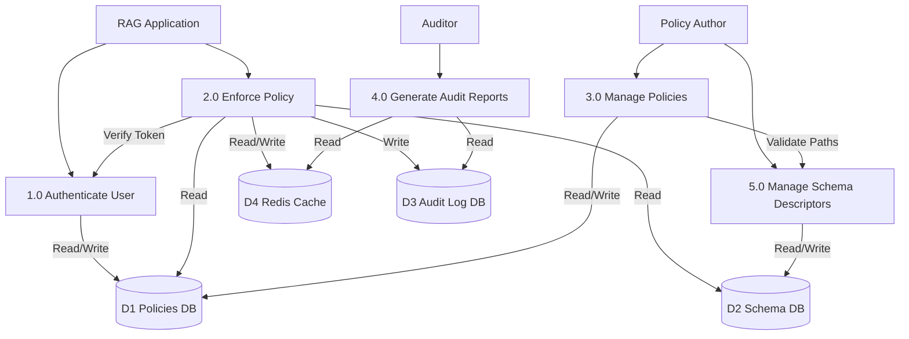
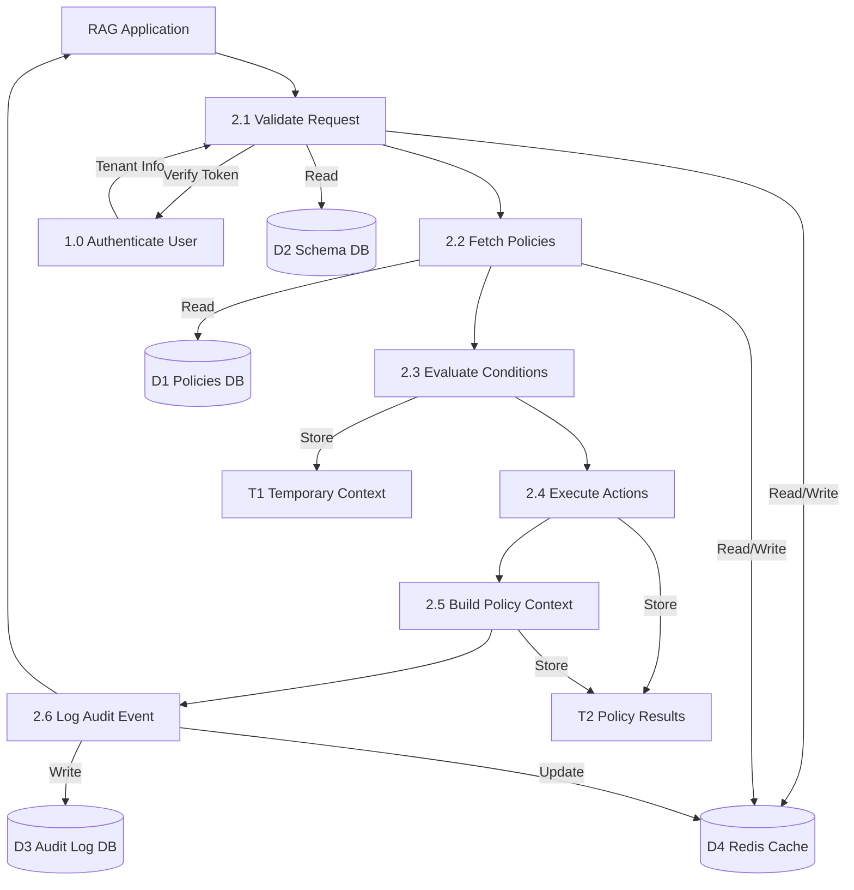

# GateKeeper Data Flow Diagrams (DFD)

This document contains Data Flow Diagrams (DFD) for the GateKeeper Policy Enforcement System at three levels, following standard Software Engineering conventions.

## DFD Levels Overview

- **Level 0 (Context Diagram)**: Shows the system as a single process with all external entities
- **Level 1 (Top-Level DFD)**: Decomposes the system into major processes and data stores
- **Level 2 (Detailed DFD)**: Decomposes the main "Enforce Policy" process into sub-processes

## Standard DFD Notation

### Symbols Used

1. **Process** (Rectangle with rounded corners)
   - Represents a transformation of data
   - Numbered (e.g., 1.0, 2.0) for hierarchical reference
   - Labeled with verb-noun phrase

2. **External Entity** (Rectangle)
   - Represents sources or destinations of data outside the system
   - Examples: Users, External Systems, Administrators

3. **Data Store** (Open rectangle or database symbol)
   - Represents data at rest
   - Labeled with noun (e.g., D1: Policies Database)
   - Can be read from or written to

4. **Data Flow** (Arrow)
   - Represents movement of data
   - Labeled with data name
   - Unidirectional

### DFD Rules (Standard SE Conventions)

1. **Conservation of Data**: Data flows must be balanced between levels
2. **No Black Holes**: Every process must have at least one output
3. **No Miracles**: Every process must have at least one input
4. **Unique Names**: All data flows and stores must have unique names
5. **Process Numbering**: Processes numbered hierarchically (1.0, 1.1, 1.2, etc.)
6. **Data Store Numbering**: Data stores numbered sequentially (D1, D2, D3, etc.)

---

## Level 0: Context Diagram

**Purpose**: Shows the GateKeeper system as a single black box interacting with external entities.

### External Entities

1. **RAG Application**: The client application that requests policy enforcement
2. **Policy Author (Studio)**: Users who create and manage policies via the Rules Studio
3. **Auditor**: Users who query audit logs and generate compliance reports
4. **System Administrator**: Administrators who configure and monitor the system

### Data Flows

#### From RAG Application
- **Enforcement Request**: Contains stage, user context, request data, and artifacts
- **Enforcement Response**: Contains decision (allowed/modified/blocked), modified data, trace, and policy context

#### From Policy Author
- **Policy Definition**: YAML/JSON policy with conditions and actions
- **Schema Descriptor**: User attributes and document metadata schema
- **Validation Results**: Errors and warnings from policy validation
- **Policy Test Results**: Results from policy testing (passed/failed)

#### From Auditor
- **Audit Query**: Filters and timeframe for audit report generation
- **Audit Reports**: Decision traces, metrics, and compliance data

#### From System Administrator
- **Configuration**: System settings and tenant setup
- **System Status**: Health checks and performance metrics

### Diagram Files
- PlantUML: `dfd_level0.puml`
- Mermaid: See below

---

## Level 1: Top-Level DFD

**Purpose**: Decomposes the GateKeeper system into major functional processes.

### Major Processes

1. **1.0 Authenticate User**
   - Validates user credentials
   - Issues JWT tokens
   - Manages tenant authentication

2. **2.0 Enforce Policy** (Main Process)
   - Evaluates policies for enforcement requests
   - Executes policy actions
   - Builds policy context for LLM
   - Returns enforcement decisions

3. **3.0 Manage Policies**
   - Validates policy definitions
   - Stores and retrieves policies
   - Tests policy behavior
   - Lints policies against schema

4. **4.0 Generate Audit Reports**
   - Queries audit logs
   - Aggregates metrics
   - Generates compliance reports
   - Identifies risky users

5. **5.0 Manage Schema Descriptors**
   - Stores schema definitions
   - Validates policy paths against schema
   - Manages schema versions

### Data Stores

- **D1: Policies Database**: Stores policies, policy versions, and tenant information
- **D2: Schema Descriptors Database**: Stores user attribute and document metadata schemas
- **D3: Audit Log Database**: Stores audit events, decision traces, and metrics
- **D4: Redis Cache**: Caches user attributes, policies, and rate limit counters

### Key Data Flows

#### Process 2.0 (Enforce Policy)
- **Inputs**: Enforcement Request from RAG Application
- **Reads from**: D1 (policies), D2 (schema), D4 (cache)
- **Writes to**: D3 (audit events), D4 (cache updates)
- **Outputs**: Enforcement Response to RAG Application

#### Process 3.0 (Manage Policies)
- **Inputs**: Policy Definition from Policy Author
- **Reads from**: D1 (existing policies), D2 (schema for validation)
- **Writes to**: D1 (new/updated policies)
- **Outputs**: Validation Results to Policy Author

### Diagram Files
- PlantUML: `dfd_level1.puml`
- Mermaid: See below

---

## Level 2: Enforce Policy Process Detail

**Purpose**: Detailed decomposition of Process 2.0 (Enforce Policy) showing internal sub-processes.

### Sub-Processes

1. **2.1 Validate Request**
   - Verifies JWT token via Process 1.0
   - Validates request format and required fields
   - Loads user context from cache or database
   - Validates against schema descriptor

2. **2.2 Fetch Policies**
   - Queries policies by stage and version
   - Filters by enabled status
   - Orders by priority
   - Caches policies in Redis

3. **2.3 Evaluate Conditions**
   - Parses 'when' clauses from policies
   - Resolves path expressions (user.role, doc.metadata.tags)
   - Evaluates 'all' and 'any' condition groups
   - Matches query patterns against request

4. **2.4 Execute Actions**
   - Executes matched policy actions:
     - **Block**: Returns blocked decision with message
     - **Rewrite**: Modifies query or filters
     - **Filter**: Adds metadata filters
     - **Redact**: Sanitizes content
   - Performs template substitution (${user.department})

5. **2.5 Build Policy Context**
   - Collects distilled prompts from applicable policies
   - Builds instruction set for LLM
   - Adds role scope and normalization hints
   - Creates policy context object

6. **2.6 Log Audit Event**
   - Creates audit record with decision and trace
   - Updates metrics counters
   - Generates audit_id
   - Writes to audit database

### Temporary Data Stores

- **T1: Temporary Context**: Stores user, request, and artifacts during processing
- **T2: Policy Results**: Stores action results, decisions, and policy context

### Data Flow Sequence

1. RAG Application sends **Enforcement Request** → 2.1
2. 2.1 validates and creates **Validated Request** → 2.2
3. 2.2 fetches policies and sends **Applicable Policies** → 2.3
4. 2.3 evaluates and sends **Matched Policies** → 2.4
5. 2.4 executes actions and sends **Distilled Prompts** → 2.5
6. 2.5 builds context and sends **Complete Response** → 2.6
7. 2.6 logs audit and sends **Enforcement Response** → RAG Application

### Diagram Files
- PlantUML: `dfd_level2.puml`
- Mermaid: See below

---

## Mermaid Versions (For GitHub/GitLab Rendering)

### Level 0 - Context Diagram

### Level 1 - Top-Level DFD

### Level 2 - Enforce Policy Detail

---

## Data Dictionary

### Key Data Flows

#### Enforcement Request
- **Source**: RAG Application
- **Destination**: Process 2.1 (Validate Request)
- **Content**: 
  - `stage`: pre_query | pre_retrieval | post_retrieval | post_generation
  - `user`: {id, role, department, ...}
  - `request`: {query, filters, ...}
  - `artifacts`: {chunks, answer, ...}
  - `policyVersion`: string
  - `correlationId`: string

#### Enforcement Response
- **Source**: Process 2.6 (Log Audit Event)
- **Destination**: RAG Application
- **Content**:
  - `decision`: allowed | modified | blocked
  - `data`: {modified query/filters/chunks}
  - `auditId`: string
  - `trace`: [{policy, action, details}]
  - `policyContext`: {instruction, rules, role_scope}

#### Policy Definition
- **Source**: Policy Author
- **Destination**: Process 3.0 (Manage Policies)
- **Content**:
  - `name`: string
  - `stage`: string
  - `when`: {all: [...], any: [...]}
  - `match`: {query.text: [...], ...}
  - `action`: {type, message, filters, ...}
  - `priority`: integer

### Data Stores

#### D1: Policies Database
- **Contents**: 
  - `policies` table: policy metadata
  - `policy_versions` table: policy content, versions, stages
  - `tenants` table: tenant information
- **Operations**: Read policies, Write policies, Read tenant info

#### D2: Schema Descriptors Database
- **Contents**:
  - `schema_descriptors` table: user_attributes, doc_metadata schemas
- **Operations**: Read schema, Write schema, Validate paths

#### D3: Audit Log Database
- **Contents**:
  - `audit_index` table: audit events, decisions, traces, metrics
- **Operations**: Write audit events, Read audit events (queries)

#### D4: Redis Cache
- **Contents**:
  - User attributes cache: `user:attrs:{id}`
  - Policy cache: `policy:{version}`
  - Rate limit counters: `rate:{tenant}:{user}:{stage}`
  - Metrics: counters and histograms
- **Operations**: Read cache, Write cache, Update counters

---

## Process Specifications

### Process 2.0: Enforce Policy

**Inputs**: Enforcement Request, JWT Token
**Outputs**: Enforcement Response, Audit Event
**Logic**:
1. Validate request and authenticate user
2. Fetch applicable policies for stage
3. Evaluate policy conditions against request context
4. Execute matched policy actions
5. Build policy context from distilled prompts
6. Log audit event with decision and trace
7. Return enforcement response

**Error Handling**:
- Invalid token → Return 401 Unauthorized
- No policies found → Return allowed decision
- Policy evaluation error → Log error, continue with next policy
- Database error → Return 500 Internal Server Error

---

## Validation Checklist

Following standard SE DFD rules:

- ✅ All processes have at least one input and one output
- ✅ All data flows are labeled
- ✅ Data stores are numbered (D1, D2, D3, D4)
- ✅ Processes are numbered hierarchically
- ✅ External entities are clearly identified
- ✅ Data flows are balanced between levels
- ✅ No black holes (processes with outputs but no inputs)
- ✅ No miracles (processes with inputs but no outputs)
- ✅ All data flows are unidirectional
- ✅ Process names use verb-noun format

---

## Usage Instructions

### Viewing PlantUML Diagrams

1. **VS Code**: Install "PlantUML" extension, open `.puml` files, use preview
2. **IntelliJ IDEA**: Install PlantUML plugin, open `.puml` files
3. **Online**: Visit http://www.plantuml.com/plantuml/uml/ and paste code

### Viewing Mermaid Diagrams

1. **GitHub/GitLab**: Diagrams in markdown files render automatically
2. **VS Code**: Install "Markdown Preview Mermaid Support" extension
3. **Online**: Visit https://mermaid.live/ and paste code

---

## References

- Yourdon, E., & DeMarco, T. (1979). Structured Analysis and System Specification
- Gane, C., & Sarson, T. (1979). Structured Systems Analysis: Tools and Techniques
- IEEE Std 1016-2009: IEEE Standard for Information Technology—Systems Design—Software Design Descriptions

---

## Revision History

- **v1.0** (2025-01-XX): Initial DFD creation with Level 0, 1, and 2 diagrams

