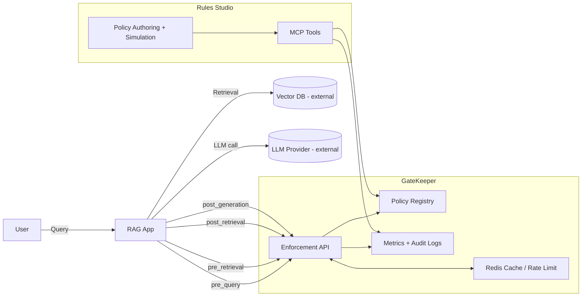
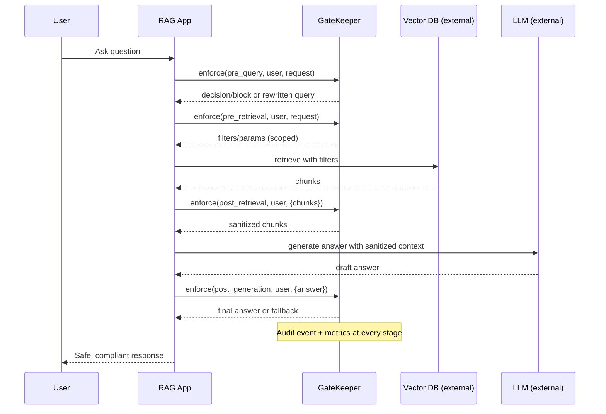

## GateKeeper Diagrams

### 1) High-level Architecture (Components)


### 2) Enforcement Stages (Sequence per Request)


### 3) Context Awareness (Schema + Runtime)
```mermaid
flowchart TB
  SD[schema.yaml (descriptor)] -->|valid fields| LINT[policy:lint]
  SD -->|drives| UI[Studio Autocomplete]
  subgraph Runtime
    UC[user_ctx]
    RC[request_ctx]
    DC[doc.metadata]
  end
  A2[Policies (YAML/JSON)] --> LINT
  LINT --> PR[Policy Registry]
  UC --> ENF[GateKeeper Enforcement]
  RC --> ENF
  DC --> ENF
  PR --> ENF
  ENF --> OBS[Audit + Metrics]
```

### 4) Risky Users Analytics (Top-N)
```mermaid
flowchart LR
  ENF[Enforcement] --> Evt[Audit Event]
  ENF --> RC[Redis Counters (blocks, attacks)]
  Evt --> IDX[Audit Index (Postgres)]
  RC --> API[/Analytics API/]
  IDX --> API
  API --> UI[Studio Dashboard]
```


