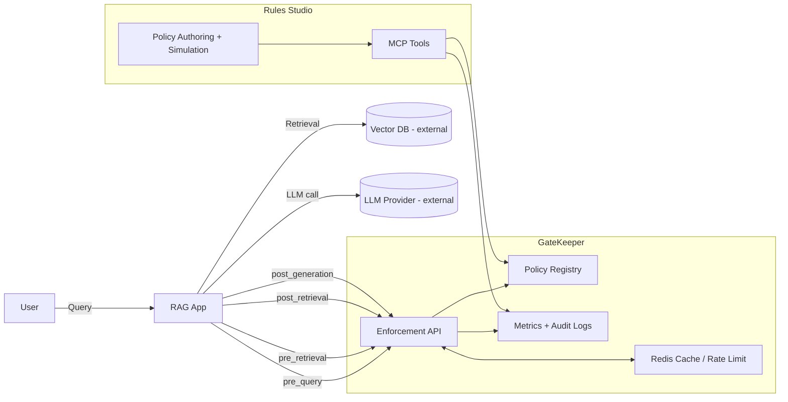
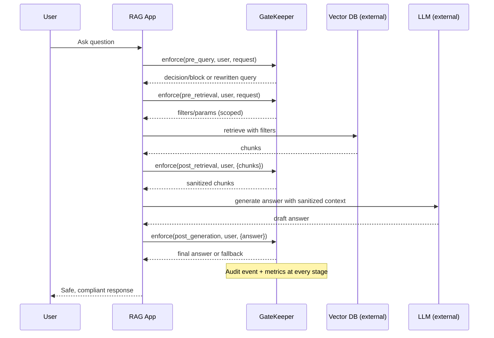
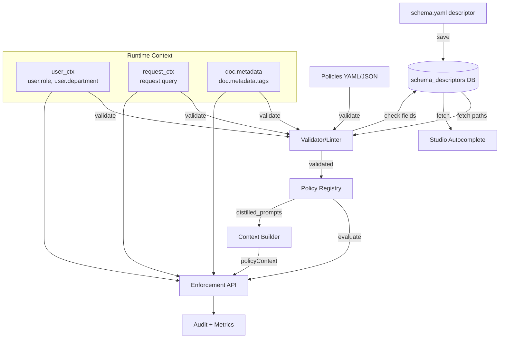
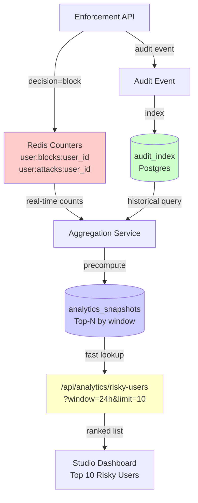

## GateKeeper Diagrams

### 1) High-level Architecture (Components)

```mermaid
flowchart LR
  U[User] -->|Query| APP[RAG App]
  subgraph GK[GateKeeper]
    PE[Enforcement API]
    PR[Policy Registry]
    RE[Redis Cache / Rate Limit]
    OBS[Metrics + Audit Logs]
  end

  APP -->|pre_query| PE
  APP -->|pre_retrieval| PE
  APP -->|post_retrieval| PE
  APP -->|post_generation| PE

  PE --> PR
  PE <---> RE
  PE --> OBS

  APP -->|Retrieval| VDB[(Vector DB - external)]
  APP -->|LLM call| LLM[(LLM Provider - external)]

  subgraph Studio[Rules Studio]
    UI[Policy Authoring + Simulation]
    MCP[MCP Tools]
  end
  UI --> MCP
  MCP --> PR
  MCP --> OBS
```

### 2) Enforcement Stages (Sequence per Request)

```mermaid
sequenceDiagram
  participant U as User
  participant A as RAG App
  participant G as GateKeeper
  participant V as Vector DB (external)
  participant L as LLM (external)

  U->>A: Ask question
  A->>G: enforce(pre_query, user, request)
  G-->>A: decision/block or rewritten query

  A->>G: enforce(pre_retrieval, user, request)
  G-->>A: filters/params (scoped)
  A->>V: retrieve with filters
  V-->>A: chunks

  A->>G: enforce(post_retrieval, user, {chunks})
  G-->>A: sanitized chunks
  A->>L: generate answer with sanitized context
  L-->>A: draft answer

  A->>G: enforce(post_generation, user, {answer})
  G-->>A: final answer or fallback
  Note over G: Audit event + metrics at every stage
  A-->>U: Safe, compliant response
```

### 3) Context Awareness (Schema + Runtime)

```mermaid
flowchart TB
  SD[schema.yaml descriptor] -->|save| DB[(schema_descriptors DB)]
  DB -->|fetch paths| VAL[Validator/Linter]
  DB -->|fetch| UI[Studio Autocomplete]
  
  POL[Policies YAML/JSON] -->|validate| VAL
  VAL -->|check fields| DB
  VAL -->|validated| PR[Policy Registry]
  
  subgraph Runtime[Runtime Context]
    UC[user_ctx<br/>user.role, user.department]
    RC[request_ctx<br/>request.query]
    DC[doc.metadata<br/>doc.metadata.tags]
  end
  
  UC -->|validate| VAL
  RC -->|validate| VAL
  DC -->|validate| VAL
  
  UC --> ENF[Enforcement API]
  RC --> ENF
  DC --> ENF
  PR -->|evaluate| ENF
  
  PR -->|distilled_prompts| CB[Context Builder]
  CB -->|policyContext| ENF
  ENF --> OBS[Audit + Metrics]
```

### 4) Risky Users Analytics (Top-N)

```mermaid
flowchart TB
  ENF[Enforcement API] -->|decision=block| RC["Redis Counters<br/>user:blocks:user_id<br/>user:attacks:user_id"]
  ENF -->|audit event| EVT[Audit Event]
  EVT -->|index| IDX[("audit_index<br/>Postgres")]
  
  RC -->|real-time counts| AGG[Aggregation Service]
  IDX -->|historical query| AGG
  
  AGG -->|precompute| SNAP[("analytics_snapshots<br/>Top-N by window")]
  SNAP -->|fast lookup| API["/api/analytics/risky-users<br/>?window=24h&limit=10"]
  
  API -->|ranked list| UI["Studio Dashboard<br/>Top 10 Risky Users"]
  
  style RC fill:#ffcccc
  style IDX fill:#ccffcc
  style SNAP fill:#ccccff
  style API fill:#ffffcc
```

